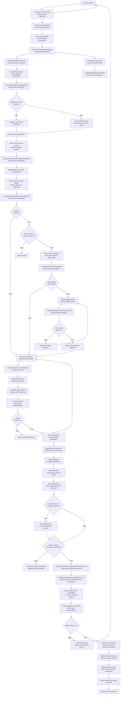

```mermaid
flowchart TB
    Start[Alışveriş Sepeti] --> Index["CheckoutController.Index()\nSepet ve kullanıcı doğrulama"]
    Index --> Start[Alışveriş Sepeti]
    Index --> StartCheckout["CheckoutController.Start()\nÖdeme işlemi başlatılıyor"]
    
    StartCheckout --> BillingAddress["Fatura Adresi Sayfası\nGerekli bilgilerin doldurulması"]
    
    BillingAddress --> SaveBilling["CheckoutController.SaveBilling()\nFatura adresi kaydediliyor"]
    
    SaveBilling --> LoadStepAfterBillingAddress["LoadStepAfterBillingAddress()\nKargo seçenekleri yükleniyor"]
    
    SaveBilling --> ShippingNotRequired["Kargolamaya gerek yok\nKargo adresi temizleniyor"]
    ShippingNotRequired --> LoadStepAfterShippingMethod["LoadStepAfterShippingMethod()\nBir sonraki adıma geçiliyor"]
    
    LoadStepAfterBillingAddress --> ShippingAddress["Kargo Adresi Sayfası\nKargo bilgilerinin doldurulması"]
    
    ShippingAddress --> SaveShipping["CheckoutController.SaveShipping()\nKargo adresi kaydediliyor"]
    
    SaveShipping --> PickUpInStore{"Mağazadan Teslim\nSeçildi mi?"}
    PickUpInStore -->|Evet| SaveSelectedPickupPoint["Seçilen teslim noktası kaydediliyor"]
    SaveSelectedPickupPoint --> BillingAddressUpdate["Fatura adresi güncellemesi"]
    
    PickUpInStore -->|Hayır| ShippingAddressProcess["Kargo adresi işleniyor\nMevcut adres ya da yeni adres"]
    ShippingAddressProcess --> BillingAddressUpdate
    
    BillingAddressUpdate --> ShippingMethod["Kargo Yöntemi Seçimi Sayfası\nKargo seçenekleri sunuluyor"]
    
    ShippingMethod --> SaveShippingMethod["CheckoutController.SaveShippingMethod()\nKargo yöntemi kaydediliyor"]
    
    SaveShippingMethod --> FindShippingOption["ShippingOption bulunuyor ve kaydediliyor"]
    FindShippingOption --> PaymentMethodSelection["Ödeme Yöntemi Seçimi Sayfası\nÖdeme yöntemleri listeleniyor"]
    
    PaymentMethodSelection --> SavePaymentMethod["CheckoutController.SavePaymentMethod()\nÖdeme yöntemi kaydediliyor"]
    
    SavePaymentMethod --> PaymentRequired{"Ödeme\nGerekli mi?"}
    
    PaymentRequired -->|Hayır| ConfirmOrder["Sipariş Onay Sayfası\nSipariş özeti gösteriliyor"]
    
    PaymentRequired -->|Evet| PaymentMethodCheck{"Seçilen Ödeme\nYöntemi Geçerli mi?"}
    
    PaymentMethodCheck -->|Hayır| PaymentError["Ödeme hatası"]
    
    PaymentMethodCheck -->|Evet| InitPaymentTransaction["Ödeme işlemi başlatılıyor\nPaymentTransaction oluşturuluyor"]
    
    InitPaymentTransaction --> LoadStepAfterPaymentMethod["LoadStepAfterPaymentMethod()\nBir sonraki adıma geçiliyor"]
    
    LoadStepAfterPaymentMethod --> SkipPaymentInfo{"Ödeme bilgisi\ngirmeyi atla?"}
    
    SkipPaymentInfo -->|Evet| ConfirmOrder
    
    SkipPaymentInfo -->|Hayır| PaymentInfo["Ödeme Bilgisi Sayfası\nÖdeme detayları giriliyor"]
    
    PaymentInfo --> SavePaymentInfo["CheckoutController.SavePaymentInfo()\nÖdeme bilgisi kaydediliyor"]
    
    SavePaymentInfo --> ValidatePaymentForm{"Ödeme formu\ngeçerli mi?"}
    
    ValidatePaymentForm -->|Hayır| PaymentInfoValidationErrors["Doğrulama hataları gösteriliyor"]
    PaymentInfoValidationErrors --> PaymentInfo
    
    ValidatePaymentForm -->|Evet| SavePaymentInfoSuccess["Ödeme bilgisi başarıyla kaydedildi"]
    SavePaymentInfoSuccess --> ConfirmOrder
    
    ConfirmOrder --> ConfirmOrderAction["CheckoutController.ConfirmOrder()\nSipariş onaylanıyor"]
    
    ConfirmOrderAction --> PlaceOrderCommand["PlaceOrderCommand\nSipariş oluşturuluyor"]
    
    PlaceOrderCommand --> PrepareProcessPayment["PrepareProcessPayment\nÖdeme işlemi hazırlanıyor"]
    
    PrepareProcessPayment --> ProcessPayment["ProcessPayment\nÖdeme işlemi gerçekleştiriliyor"]
    
    ProcessPayment --> PaymentSuccess{"Ödeme\nBaşarılı mı?"}
    
    PaymentSuccess -->|Hayır| PaymentErrors["Ödeme hataları gösteriliyor"]
    PaymentErrors --> ConfirmOrder
    
    PaymentSuccess -->|Evet| SaveOrderDetails["SaveOrderDetails\nSipariş detayları kaydediliyor"]
    
    SaveOrderDetails --> UpdatePaymentTransaction["UpdatePaymentTransaction\nÖdeme işlemi güncelleniyor"]
    
    UpdatePaymentTransaction --> SendNotification["SendNotification\nBildirimler gönderiliyor"]
    
    SendNotification --> CheckOrderStatus["CheckOrderStatus\nSipariş durumu kontrol ediliyor"]
    
    CheckOrderStatus --> OrderPlacedEvent["OrderPlacedEvent\nSipariş oluşturuldu eventi tetikleniyor"]
    
    OrderPlacedEvent --> CheckPaidStatus{"Ödeme durumu\nTamamen Ödendi mi?"}
    
    CheckPaidStatus -->|Evet| ProcessOrderPaid["ProcessOrderPaid\nÖdeme tamamlandı işlemleri"]
    
    CheckPaidStatus -->|Hayır| RedirectionPayment{"Ödeme Yöntemi\nYönlendirme Türünde mi?"}
    ProcessOrderPaid --> RedirectionPayment
    
    RedirectionPayment -->|Hayır| Completed["CheckoutController.Completed()\nSipariş tamamlandı sayfası"]
    
    RedirectionPayment -->|Evet| CompleteRedirectionPayment["CheckoutController.CompleteRedirectionPayment()\nYönlendirme ödeme tamamlanıyor"]
    
    CompleteRedirectionPayment --> StripeCheckoutService["StripeCheckoutService.CreateRedirectUrl\nÖdeme sayfasına yönlendirme URL'i oluşturuluyor"]
    
    StripeCheckoutService --> RedirectToPaymentGateway["Ödeme sağlayıcısına yönlendirme\n(ör. Stripe Checkout sayfası)"]
    
    RedirectToPaymentGateway --> PaymentGatewayProcess["Ödeme sağlayıcısı üzerinde\nödeme işlemi gerçekleştiriliyor"]
    
    PaymentGatewayProcess --> PaymentGatewaySuccess{"Ödeme Başarılı mı?"}
    
    PaymentGatewaySuccess -->|Hayır| PaymentGatewayCancelled["Ödeme iptal edildi\nSipariş iptal durumuna alınıyor"]
    PaymentGatewayCancelled --> Start
    
    PaymentGatewaySuccess -->|Evet| RedirectBackToSite["Siteye geri yönlendirme\nWebhook ile ödeme durumu güncelleniyor"]
    
    RedirectBackToSite --> WebHookProcessPayment["WebHookProcessPayment\nÖdeme webhook işleniyor"]
    
    WebHookProcessPayment --> MarkAsPaid["MarkAsPaidCommand\nSipariş ödenmiş olarak işaretleniyor"]
    
    MarkAsPaid --> OrderCompleted["Sipariş tamamlandı sayfası gösteriliyor"]

    OrderCompleted --> End[Sipariş süreci tamamlandı]
```